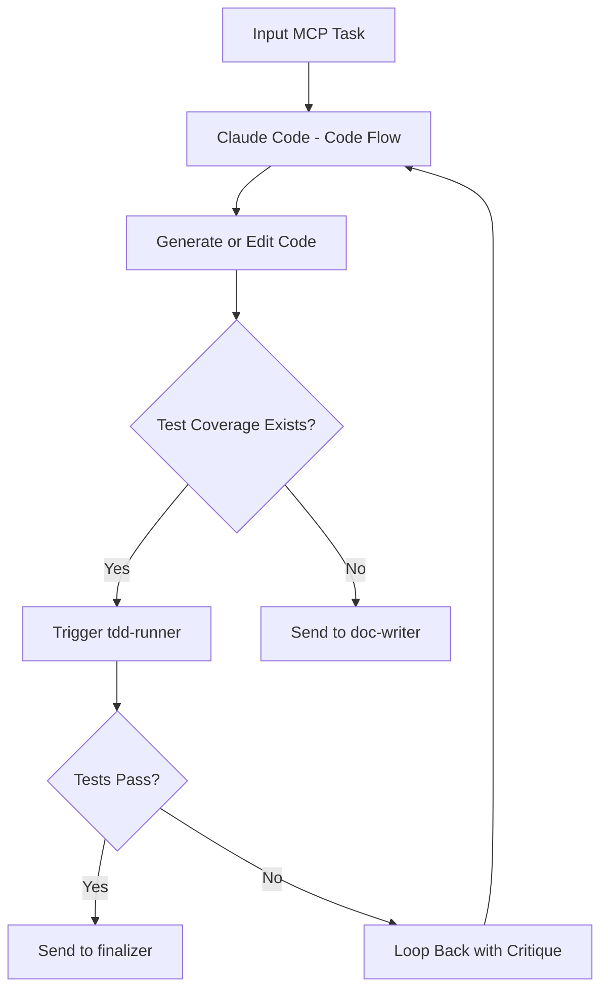

# Claude Code MCP – `code-flow` Mode

This MCP mode defines a **code execution and refinement flow** using **Claude Code** as the reasoning engine. It’s designed for RooCode-style agentic environments where agents operate recursively, orchestrating the build process through contextual task flows.

This mode serves as a **code-first orchestration layer**, enabling Claude to write, edit, test, and optimize code autonomously across recursive agent cycles.

---

## 🔧 Mode Overview

**Slug**: `code-flow`
**Agent**: Claude Code (Opus or Sonnet)
**Stack**: RooCode + MCP JSON + Modular CLI
**Primary Role**: Autonomous code execution loop with reflection, patching, and structural analysis

---

## 🧠 Role Definition

```json
{
  "slug": "code-flow",
  "name": "💻 Claude Code Flow",
  "roleDefinition": "Use Claude Code to execute recursive code generation, test validation, and optimization tasks as part of a RooCode development pipeline. Accepts MCP context and returns structured diffs, summaries, and follow-up task suggestions. Coordinates with modes such as prompt-generator, tdd-runner, and memory-manager.",
  "customInstructions": "Perform context-aware code editing using patch logic. Return complete file paths, line references, and explicit changes. Trigger sub-agents for testing or doc generation when structural shifts are detected.",
  "groups": ["read", "edit", "reflect"],
  "source": "roocode"
}
```

---

## 📌 Features

* **Delta-Aware Editing**: Uses diff-style editing to minimize token overhead and reduce hallucination.
* **Test-Aware Refactoring**: Integrates with `tdd-runner` mode to validate changes in real-time.
* **Feedback-Driven Loops**: Submits diffs and receives critical feedback from `reflection` and `critic` agents.
* **Multi-File Capability**: Can handle multiple source files, updating imports and dependencies contextually.

---

## 🔄 Flow Summary



---

## 🚀 Usage

### Sample Invocation (in RooCode)

```json
{
  "mode": "code-flow",
  "input": {
    "task_id": "generate-auth-service",
    "files": ["./services/auth.ts"],
    "description": "Implement OAuth2 token handler and refresh logic",
    "requirements": ["Use JWT", "Support Google login", "Add tests"]
  }
}
```

---

## 🧪 Integration

This mode expects the following modes to be available in `.roomodes`:

* `prompt-generator`
* `tdd-runner`
* `memory-manager`
* `reflection`
* `critic`
* `doc-writer` *(optional)*

---

## 🧩 Outputs

Each cycle returns:

* `patch`: Minimal structured diff of file edits
* `summary`: Plaintext reasoning summary
* `next_tasks`: Optional follow-ups for orchestration agents
* `confidence_score`: Heuristic between 0–1 based on test performance or internal logic certainty

---

## 🗂 Directory Structure

```
/modes
  ├── code-flow/
  │   ├── handler.ts
  │   ├── config.json
  │   └── prompts/
  │       └── base_prompt.txt
/src
  └── ...
.mcp.json
.roomodes
```

---

## 📣 Coming Soon

I'll be sharing a full walkthrough on how this integrates with my broader agentic stack using RooCode and SPARC workflows. It includes how to auto-assemble and deploy this MCP using Claude in a recursive build loop.

---

## 🧭 Final Note

This isn’t just about making Claude write code. It’s about making it think through code recursively—**like an engineer**, not just a scribe.

If you're building agentic systems and want to see how deep you can go with autonomous orchestration, `code-flow` is where the real work starts.
 
