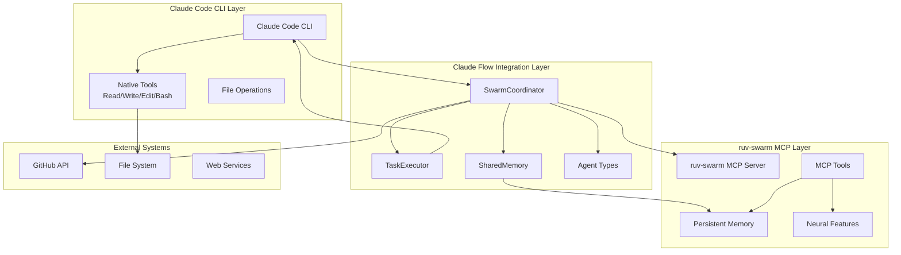
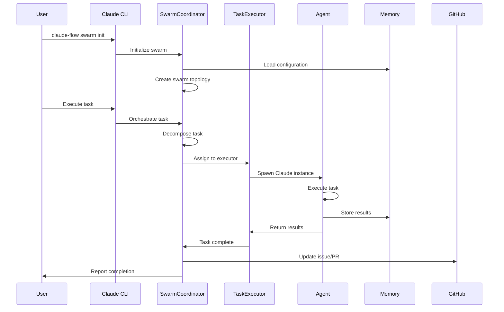
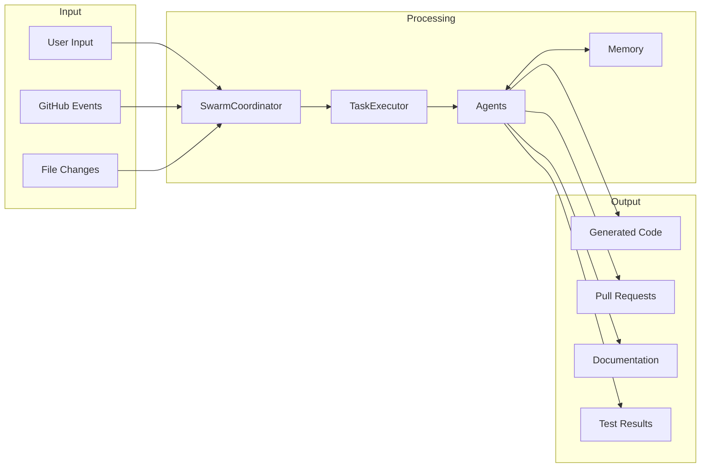

# Claude Flow v2.0.0 Architecture Design

## Executive Summary

Claude Flow v2.0.0 represents a complete integration of Claude Code CLI with ruv-swarm orchestration capabilities, creating a powerful autonomous development system. This architecture enables parallel execution, intelligent task coordination, and seamless GitHub workflow integration.

## Architecture Overview



## Core Components

### 1. SwarmCoordinator (Full Implementation)

The SwarmCoordinator is the central orchestration component that manages the entire swarm lifecycle.

```typescript
interface SwarmCoordinator {
  // Lifecycle Management
  async initialize(config: SwarmConfig): Promise<void>
  async start(): Promise<void>
  async stop(): Promise<void>
  async shutdown(): Promise<void>
  
  // Swarm Operations
  async createSwarm(config: SwarmConfig): Promise<SwarmId>
  async spawnAgent(type: AgentType, config: AgentConfig): Promise<AgentId>
  async orchestrateTask(task: TaskDefinition): Promise<TaskResult>
  
  // Coordination
  async assignTask(taskId: TaskId, agentId: AgentId): Promise<void>
  async balanceLoad(): Promise<void>
  async handleFailure(agentId: AgentId, error: Error): Promise<void>
  
  // Monitoring
  getSwarmStatus(): SwarmStatus
  getAgentMetrics(agentId: AgentId): AgentMetrics
  getTaskProgress(taskId: TaskId): TaskProgress
}
```

**Key Features:**
- **Dynamic Agent Spawning**: Automatically spawn Claude CLI instances based on workload
- **Intelligent Task Assignment**: Match tasks to agents based on capabilities and performance
- **Load Balancing**: Distribute work evenly across available agents
- **Failure Recovery**: Automatic retry and reassignment of failed tasks
- **Real-time Monitoring**: Track swarm health, progress, and performance

### 2. TaskExecutor (Parallel Execution Engine)

The TaskExecutor manages the actual execution of tasks using Claude CLI instances.

```typescript
interface TaskExecutor {
  // Task Execution
  async executeTask(task: TaskDefinition, agent: AgentState): Promise<TaskResult>
  async executeParallel(tasks: TaskDefinition[]): Promise<TaskResult[]>
  async executePipeline(pipeline: TaskPipeline): Promise<PipelineResult>
  
  // Claude CLI Integration
  async spawnClaude(config: ClaudeConfig): Promise<ClaudeInstance>
  async sendPrompt(instance: ClaudeInstance, prompt: string): Promise<string>
  async terminateClaude(instance: ClaudeInstance): Promise<void>
  
  // Resource Management
  async allocateResources(task: TaskDefinition): Promise<ResourceAllocation>
  async releaseResources(allocation: ResourceAllocation): Promise<void>
  async monitorResources(): Promise<ResourceMetrics>
  
  // Error Handling
  async handleTimeout(task: TaskDefinition): Promise<void>
  async handleError(task: TaskDefinition, error: Error): Promise<void>
  async retryTask(task: TaskDefinition, attempt: number): Promise<TaskResult>
}
```

**Key Features:**
- **Parallel Execution**: Run multiple Claude instances simultaneously
- **Resource Pooling**: Maintain a pool of Claude instances for quick task assignment
- **Timeout Management**: Enforce task timeouts and handle long-running operations
- **Error Recovery**: Automatic retry with exponential backoff
- **Progress Tracking**: Real-time updates on task execution status

### 3. SharedMemory System

The SharedMemory system enables coordination and knowledge sharing between agents.

```typescript
interface SharedMemory {
  // Memory Operations
  async store(key: string, value: any, metadata?: MemoryMetadata): Promise<void>
  async retrieve(key: string): Promise<any>
  async search(query: MemoryQuery): Promise<MemoryEntry[]>
  async delete(key: string): Promise<void>
  
  // Agent Memory
  async getAgentMemory(agentId: AgentId): Promise<AgentMemory>
  async shareMemory(from: AgentId, to: AgentId, key: string): Promise<void>
  async broadcastMemory(key: string, agents: AgentId[]): Promise<void>
  
  // Knowledge Base
  async createKnowledgeBase(name: string, domain: string): Promise<KnowledgeBaseId>
  async updateKnowledge(kbId: KnowledgeBaseId, entry: KnowledgeEntry): Promise<void>
  async queryKnowledge(kbId: KnowledgeBaseId, query: string): Promise<KnowledgeEntry[]>
  
  // Synchronization
  async sync(): Promise<void>
  async backup(): Promise<BackupId>
  async restore(backupId: BackupId): Promise<void>
}
```

**Key Features:**
- **Distributed Memory**: Share state across all agents in the swarm
- **Knowledge Persistence**: Store learnings and insights for future use
- **Efficient Retrieval**: Fast search and retrieval of relevant information
- **Memory Partitioning**: Separate memory spaces for different contexts
- **Automatic Synchronization**: Keep memory consistent across the swarm

### 4. Agent Type System

A comprehensive agent type system with specialized capabilities.

```typescript
enum AgentType {
  COORDINATOR = 'coordinator',      // Orchestrates other agents
  RESEARCHER = 'researcher',        // Gathers information
  DEVELOPER = 'developer',          // Writes code
  ANALYZER = 'analyzer',            // Analyzes data/code
  REVIEWER = 'reviewer',            // Reviews work
  TESTER = 'tester',               // Tests functionality
  DOCUMENTER = 'documenter',        // Creates documentation
  MONITOR = 'monitor',             // Monitors system
  SPECIALIST = 'specialist'         // Domain-specific
}

interface AgentCapabilities {
  // Core Capabilities
  primarySkills: string[]
  secondarySkills: string[]
  tools: ToolType[]
  
  // Performance Characteristics
  speed: number         // 1-10 scale
  accuracy: number      // 1-10 scale
  creativity: number    // 1-10 scale
  reliability: number   // 1-10 scale
  
  // Resource Requirements
  memoryRequired: number
  cpuRequired: number
  maxConcurrentTasks: number
}
```

**Agent Specializations:**
1. **Coordinator**: High-level orchestration, task decomposition
2. **Researcher**: Web search, documentation analysis, fact gathering
3. **Developer**: Code generation, implementation, refactoring
4. **Analyzer**: Code analysis, performance profiling, security scanning
5. **Reviewer**: Code review, quality assurance, best practices
6. **Tester**: Test creation, execution, coverage analysis
7. **Documenter**: API docs, user guides, technical writing
8. **Monitor**: System monitoring, performance tracking, alerting
9. **Specialist**: Domain-specific tasks (e.g., DevOps, Security, ML)

### 5. GitHub Workflow Integration

Deep integration with GitHub for automated workflow management.

```typescript
interface GitHubIntegration {
  // Repository Management
  async analyzeRepository(repo: string): Promise<RepoAnalysis>
  async createBranch(name: string, from: string): Promise<void>
  async createPullRequest(config: PRConfig): Promise<PullRequest>
  
  // Workflow Automation
  async createWorkflow(config: WorkflowConfig): Promise<void>
  async triggerWorkflow(workflowId: string): Promise<WorkflowRun>
  async monitorWorkflow(runId: string): Promise<WorkflowStatus>
  
  // Issue Management
  async createIssue(config: IssueConfig): Promise<Issue>
  async updateIssue(issueId: string, update: IssueUpdate): Promise<void>
  async linkPRToIssue(prId: string, issueId: string): Promise<void>
  
  // Code Review
  async requestReview(prId: string, reviewers: string[]): Promise<void>
  async postReviewComment(prId: string, comment: ReviewComment): Promise<void>
  async approveChanges(prId: string): Promise<void>
}
```

**GitHub Features:**
- **Automated PR Creation**: Create PRs with proper descriptions and labels
- **Issue Tracking**: Update issues automatically as work progresses
- **Workflow Generation**: Create GitHub Actions workflows programmatically
- **Review Coordination**: Manage multi-reviewer processes
- **Release Management**: Automate release preparation and deployment

### 6. SPARC Methodology Support

Full support for SPARC (Specification, Pseudocode, Architecture, Refinement, Completion) methodology.

```typescript
interface SparcSupport {
  // SPARC Phases
  async executeSpecification(objective: string): Promise<Specification>
  async generatePseudocode(spec: Specification): Promise<Pseudocode>
  async designArchitecture(pseudo: Pseudocode): Promise<Architecture>
  async refineImplementation(arch: Architecture): Promise<Implementation>
  async completeProject(impl: Implementation): Promise<CompletedProject>
  
  // Mode Management
  async activateMode(mode: SparcMode): Promise<void>
  async switchMode(from: SparcMode, to: SparcMode): Promise<void>
  async getModeCapabilities(mode: SparcMode): Promise<ModeCapabilities>
}
```

**SPARC Modes:**
1. **Specification Mode**: Requirements gathering and analysis
2. **Pseudocode Mode**: High-level algorithm design
3. **Architecture Mode**: System design and structure
4. **Refinement Mode**: Iterative improvement
5. **Completion Mode**: Final implementation and testing

### 7. Neural Network Features

Advanced neural network capabilities for learning and adaptation.

```typescript
interface NeuralFeatures {
  // Pattern Recognition
  async learnPattern(pattern: Pattern): Promise<void>
  async recognizePattern(input: any): Promise<Pattern[]>
  async suggestOptimization(context: Context): Promise<Optimization[]>
  
  // Performance Learning
  async recordSuccess(task: TaskDefinition, result: TaskResult): Promise<void>
  async recordFailure(task: TaskDefinition, error: Error): Promise<void>
  async predictSuccess(task: TaskDefinition): Promise<number>
  
  // Adaptive Behavior
  async adaptStrategy(feedback: Feedback): Promise<void>
  async optimizeWorkflow(workflow: Workflow): Promise<OptimizedWorkflow>
  async personalizeAgent(agentId: AgentId, preferences: Preferences): Promise<void>
}
```

**Neural Capabilities:**
- **Pattern Learning**: Learn from successful task completions
- **Failure Prediction**: Anticipate potential issues
- **Workflow Optimization**: Continuously improve processes
- **Adaptive Strategies**: Adjust approach based on results
- **Performance Prediction**: Estimate task completion times

## Implementation Architecture

### Directory Structure

```
/workspaces/claude-code-flow/
├── src/
│   ├── coordination/
│   │   ├── swarm-coordinator.ts      # Main coordinator
│   │   ├── task-executor.ts          # Task execution engine
│   │   ├── load-balancer.ts          # Load balancing
│   │   ├── agent-manager.ts          # Agent lifecycle
│   │   └── workflow-engine.ts        # Workflow execution
│   ├── memory/
│   │   ├── shared-memory.ts          # Shared memory system
│   │   ├── knowledge-base.ts         # Knowledge management
│   │   ├── memory-sync.ts            # Synchronization
│   │   └── cache-manager.ts          # Performance caching
│   ├── agents/
│   │   ├── agent-factory.ts          # Agent creation
│   │   ├── agent-types/              # Type implementations
│   │   ├── capabilities.ts           # Capability definitions
│   │   └── agent-pool.ts             # Agent pooling
│   ├── github/
│   │   ├── workflow-generator.ts     # GitHub Actions
│   │   ├── pr-manager.ts             # PR automation
│   │   ├── issue-tracker.ts          # Issue management
│   │   └── release-manager.ts        # Release automation
│   ├── sparc/
│   │   ├── sparc-engine.ts           # SPARC methodology
│   │   ├── mode-manager.ts           # Mode switching
│   │   ├── phase-executor.ts         # Phase execution
│   │   └── sparc-templates/          # Phase templates
│   └── neural/
│       ├── pattern-recognition.ts     # Pattern learning
│       ├── performance-predictor.ts   # Success prediction
│       ├── workflow-optimizer.ts      # Optimization
│       └── adaptive-strategy.ts       # Strategy adaptation
```

### Communication Flow



### Data Flow



## Key Design Decisions

### 1. Separation of Concerns
- **Claude Code CLI**: Handles all file operations and code generation
- **ruv-swarm MCP**: Provides coordination and memory capabilities
- **Claude Flow**: Integrates both systems seamlessly

### 2. Parallel Execution Strategy
- Use process pooling for Claude CLI instances
- Implement work-stealing for load balancing
- Enable pipeline parallelism for dependent tasks

### 3. Memory Architecture
- Hierarchical memory structure for efficient retrieval
- Separate memory spaces for different contexts
- Automatic garbage collection for old entries

### 4. Error Handling
- Circuit breakers for failing agents
- Exponential backoff for retries
- Graceful degradation under load

### 5. Security Considerations
- Sandboxed execution environments
- API key management
- Rate limiting for external services

## Performance Optimizations

### 1. Agent Pooling
```typescript
class AgentPool {
  private readonly minAgents = 2
  private readonly maxAgents = 10
  private agents: Map<AgentId, AgentInstance> = new Map()
  
  async getAgent(type: AgentType): Promise<AgentInstance> {
    // Return available agent or spawn new one
  }
  
  async releaseAgent(agentId: AgentId): Promise<void> {
    // Return agent to pool for reuse
  }
}
```

### 2. Task Batching
```typescript
class TaskBatcher {
  private readonly batchSize = 5
  private readonly batchTimeout = 1000 // ms
  
  async batchTasks(tasks: TaskDefinition[]): Promise<TaskBatch[]> {
    // Group related tasks for efficient execution
  }
}
```

### 3. Memory Caching
```typescript
class MemoryCache {
  private readonly cache = new LRUCache<string, any>(1000)
  private readonly ttl = 5 * 60 * 1000 // 5 minutes
  
  async get(key: string): Promise<any> {
    // Check cache before querying SharedMemory
  }
}
```

## Integration Points

### 1. Claude Code CLI Integration
```typescript
interface ClaudeCliIntegration {
  // Process management
  spawn(config: ClaudeConfig): Promise<ChildProcess>
  kill(pid: number): Promise<void>
  
  // Communication
  sendPrompt(process: ChildProcess, prompt: string): Promise<void>
  readResponse(process: ChildProcess): Promise<string>
  
  // Tool usage
  executeTools(tools: ToolCall[]): Promise<ToolResults>
}
```

### 2. ruv-swarm MCP Integration
```typescript
interface RuvSwarmIntegration {
  // MCP communication
  connect(config: McpConfig): Promise<McpClient>
  callTool(tool: string, params: any): Promise<any>
  
  // Memory operations
  storeMemory(key: string, value: any): Promise<void>
  retrieveMemory(key: string): Promise<any>
  
  // Neural features
  trainPattern(pattern: Pattern): Promise<void>
  predictOutcome(input: any): Promise<Prediction>
}
```

### 3. GitHub API Integration
```typescript
interface GitHubApiIntegration {
  // Authentication
  authenticate(token: string): Promise<void>
  
  // Repository operations
  getRepo(owner: string, repo: string): Promise<Repository>
  createPR(config: PRConfig): Promise<PullRequest>
  
  // Workflow management
  createWorkflow(yaml: string): Promise<void>
  triggerWorkflow(id: string): Promise<WorkflowRun>
}
```

## Deployment Architecture

### 1. Local Development
```yaml
# docker-compose.yml
version: '3.8'
services:
  claude-flow:
    build: .
    volumes:
      - ./workspace:/workspace
      - ~/.claude:/root/.claude
    environment:
      - CLAUDE_API_KEY=${CLAUDE_API_KEY}
      - GITHUB_TOKEN=${GITHUB_TOKEN}
  
  ruv-swarm:
    image: ruv-swarm:latest
    ports:
      - "3000:3000"
    volumes:
      - ./memory:/data/memory
```

### 2. CI/CD Integration
```yaml
# .github/workflows/claude-flow.yml
name: Claude Flow CI/CD
on:
  push:
    branches: [main]
  pull_request:
    types: [opened, synchronize]

jobs:
  claude-flow:
    runs-on: ubuntu-latest
    steps:
      - uses: actions/checkout@v3
      - name: Run Claude Flow
        run: |
          npx claude-flow swarm init --topology hierarchical
          npx claude-flow swarm spawn developer analyzer tester
          npx claude-flow task orchestrate "Review and test PR"
```

### 3. Production Deployment
```typescript
interface ProductionConfig {
  // Scaling
  autoScale: {
    minAgents: 5,
    maxAgents: 50,
    scaleUpThreshold: 0.8,
    scaleDownThreshold: 0.2
  }
  
  // Monitoring
  monitoring: {
    enableMetrics: true,
    enableTracing: true,
    enableLogging: true,
    alertThresholds: {
      errorRate: 0.05,
      latency: 5000,
      cpuUsage: 0.9
    }
  }
  
  // Security
  security: {
    enableAuth: true,
    enableEncryption: true,
    apiRateLimit: 1000,
    maxConcurrentUsers: 100
  }
}
```

## Migration Strategy

### Phase 1: Core Infrastructure (Week 1-2)
1. Implement enhanced SwarmCoordinator
2. Integrate TaskExecutor with Claude CLI
3. Set up SharedMemory system
4. Create agent type definitions

### Phase 2: Integration (Week 3-4)
1. Connect Claude Code CLI with swarm system
2. Implement ruv-swarm MCP integration
3. Set up GitHub workflow automation
4. Create SPARC methodology support

### Phase 3: Advanced Features (Week 5-6)
1. Implement neural network features
2. Add performance optimizations
3. Create monitoring and analytics
4. Set up production deployment

### Phase 4: Testing & Documentation (Week 7-8)
1. Comprehensive testing suite
2. Performance benchmarking
3. Documentation and examples
4. User guides and tutorials

## Success Metrics

### Performance Metrics
- **Task Throughput**: >100 tasks/hour
- **Parallel Efficiency**: >80% CPU utilization
- **Memory Usage**: <2GB per swarm
- **Response Time**: <500ms for task assignment

### Quality Metrics
- **Success Rate**: >95% task completion
- **Error Recovery**: >90% automatic recovery
- **Code Quality**: >80% test coverage
- **Documentation**: 100% API coverage

### User Metrics
- **Setup Time**: <5 minutes
- **Learning Curve**: <1 hour to productivity
- **User Satisfaction**: >4.5/5 rating
- **Community Adoption**: >1000 users in 3 months

## Conclusion

Claude Flow v2.0.0 architecture provides a robust, scalable, and intelligent system for autonomous development. By combining Claude Code CLI's powerful capabilities with ruv-swarm's orchestration features, we create a system that can handle complex development tasks with minimal human intervention.

The architecture prioritizes:
- **Scalability**: Handle projects of any size
- **Reliability**: Automatic error recovery and failover
- **Performance**: Parallel execution and optimization
- **Usability**: Simple commands, powerful results
- **Extensibility**: Easy to add new capabilities

This design positions Claude Flow as the premier autonomous development platform, enabling developers to focus on high-level objectives while the system handles implementation details.